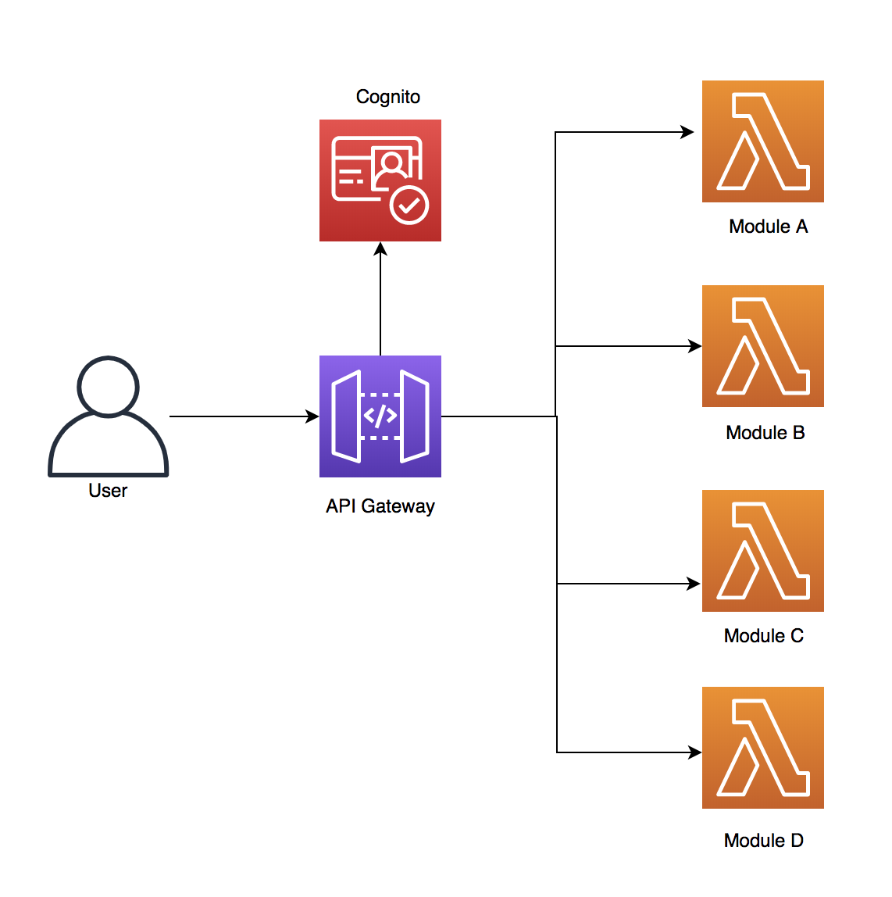

# Serverless API using CI/CD tool

Create a new serverless API on AWS with a CI/CD pipeline.


### Architecture 





### CI/CD workflow

The CI/CD workflow follows the one described in [this repository](https://github.com/MatthieuBlais/aws-cicd).


#### Customizations

The codebuild job has been customized to meet the need of the application. 

1. **API Specifications**: The API definition is written following the [OpenAPI](https://swagger.io/) standard. The specifications must be uploaded before creating or updating the API Gateway resource.

2. **Environment variables**: Cognito creates a UserPoolId and an AppClientID and the lambda functions must be triggered by an API Gateway name. Those constant variables are different in dev, uat or production environment and it's important that the CodeBuild job uses the right variables for the right environment. An additional `platform/vars.yaml` has been created. Each key is the name of a branch and the value is a dictionary of environment variables. The job replaces the value accordingly in the `deployspec.yaml` before deploying.

3. **API Deploy**: Once the API Gateway has been updated, a new deployment stage is created. 


### Setup 

1. Create a CI/CD project following the setup process here. #BUT#, update the AppBuild in `project.yaml` like this:

```
  BuildSpec: |
          version: 0.2
          phases:
            pre_build:
              commands:
                - aws s3 cp $RUN_SCRIPT ./run.py
                - pip install pyaml boto3
                - pip install --upgrade awscli
                - apt-get update && apt-get install zip
            build:
              commands:
                - python run.py build $BRANCH $BUILD_NUMBER

            post_build:
              commands:
                - cat compile-response.txt || true
                - cat deploy-response.txt || true 
```

Also, in the `deployspec.yaml`, set the parameter CodebuildImage to `aws/codebuild/python:3.6.5`.

2. Clone or download this repository in your newly created project.
3. Deploy the run.py as new codebuild job for the CI/CD pipeline. Refer to the tool documentation.
4. In `platform/vars.yaml`, set the project name under your branch name. 
5. In `platform/deployspec.yaml`, comment all the stacks excpet those under "Cognito", commit and push.
6. Check Cloudformation and note the UserPoolId and AppClientId that have been created. Add them to `platform/vars.yaml`
7. Uncomment the stacks under "API IAM" and "API" in `platform/deployspec.yaml`, commit and push.
8. Check Cloudformation and note the API Name. Add it to `platform/vars.yaml`.
9. Uncomment the last block under "Lambdas", commit and push.
10. Add more endpoints in the application and more lambda function below the "LAMBDA" block in `platform/deployspec.yaml`.


### Cognito

The API uses Cognito for authentication. Once the Cognito stacks have been deployed, use these commands to create a new user:

Create a user:

```aws cognito-idp admin-create-user --user-pool-id <value> --username <value>```


Change password:

```aws cognito-idp admin-set-user-password --user-pool-id <value> --username <value> --password <value>```


Login:

```aws cognito-idp initiate-auth --auth-flow USER_PASSWORD_AUTH --auth-parameters USERNAME=<value>,PASSWORD=<value> --client-id <value>```


Respond to challenge and get tokenId:

```aws cognito-idp admin-respond-to-auth-challenge --user-pool-id <value> --client-id <value> --challenge-responses "NEW_PASSWORD=<value>,USERNAME=<value>" --challenge-name NEW_PASSWORD_REQUIRED --session <value>```


When calling the API, add the tokenID in the headers:

```Authorization: Bearer TOKEN_ID```


Next time you login:

```aws cognito-idp initiate-auth --auth-flow USER_PASSWORD_AUTH --auth-parameters USERNAME=<value>,PASSWORD=<value> --client-id <value>```


##### Configure the API with Cognito:

The API is configured to use Cognito. In ```application/doc/specs.yaml```, under components.securitySchemes:

```
securitySchemes:
    securityCognitoPool:
      type: apiKey
      name: Authorization
      in: header
      x-amazon-apigateway-authtype: cognito_user_pools
      x-amazon-apigateway-authorizer:
        type: cognito_user_pools
        providerARNs: 
          - Fn::Sub: arn:aws:cognito-idp:${AWS::Region}:${AWS::AccountId}:userpool/${UserPoolId}
```

In each endpoint that needs to be called by an authenticated user, add:

```
security:
    - securityCognitoPool: []
```

##### Parse the Cognito token in the application

In `application/utils/cognito.py`, find a class to parse the JWT token (TokenID) provided by Cognito. The lambda functions can call it to extract the email or userId of the authenticated user. 

Find more details on this [page](https://github.com/awslabs/aws-support-tools/tree/master/Cognito/decode-verify-jwt).


### API Sepification

The API endpoints are defined in `application/doc/specs.yaml`. It follows the OpenAPI standard. During the deployment, the specifications are uploaded to S3 and used by Cloudformation to create or update the API Gateway. 

To use dynamic variables (for example, to use different lambda function names in different environments), add them to the list of Cloudformation parameters as the specifications will be included in the template.

```
Body:
  Fn::Transform:
    Name: AWS::Include
    Parameters:
      Location: !Sub "s3://${ApplicationBucketName}/api/${Env}/${Build}/specs.yaml"
```


##### CORS configuration:

Read [this](https://docs.aws.amazon.com/apigateway/latest/developerguide/how-to-cors.html) to know more about CORS. 

To configure CORS for the API, add an OPTIONS method under each endpoint in the OpenAPI specifications file, with this configuration:

```
options:
      summary: CORS support
      x-amazon-apigateway-integration:
        type: mock
        requestTemplates:
          application/json: |
            { "statusCode" : 200 }
        responses:
          "default":
            statusCode: "200"
            headers:
              Access-Control-Allow-Headers: "'Content-Type,X-Amz-Date,Authorization,X-Api-Key'"
              Access-Control-Allow-Methods: "'*'"
              Access-Control-Allow-Origin: "'*'"
            responseTemplates:
              application/json: |
                {}
      responses:
        "200":
          description: Default response for CORS method
```

##### Lambda functions

In this example, the functions are developed in Python3.6 and take advantage of the [AWS Chalice framework](https://github.com/aws/chalice). 

Notice the `application/package/sh` file. This script is called during the deployment by CodeBuild. It packages the lambda functions nicely. 

Use the `application/local-test.sh` to start the Chalice server locally and test the API. Make sure to have Chalice packages already installed.


